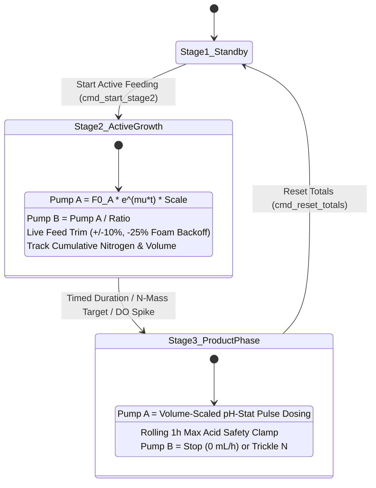

# Stoichiometric Fed-Batch & Dynamic C:N Controller

Generalized Mycodo custom function for advanced dual-pump fed-batch bioprocesses (e.g., Carbon + Nitrogen feeding, Substrate + Co-feed, Acid + Base). Couples first-principles stoichiometric mass balances ($Y_{X/S}, Y_{X/N}$), physiological stage transition triggers (nitrogen mass delivered / DO-spike), live feed rate trimming & foam mitigation, and volume-scaled feedback dosing with safety clamping.

---

## Key Capabilities

1. **Direct Rates & First-Principles Stoichiometric Modeling:**
   - Supports pre-calculated exponential feed curves ($F_{0,A} e^{\mu t}, F_{0,B} e^{\mu t}$) or derives starting rates ($F_{0,A}, F_{0,B}$), optimal stoichiometric ratio ($R_{A:B}$), and target nitrogen mass from first principles ($V_0, X_0, X_{\text{target}}, Y_{X/S}, Y_{X/N}, S_{i,A}, N_{i,B}$).
2. **Live Feed Trimming & Foam Mitigation:**
   - Real-time `feed_rate_scale` multiplier with dedicated UI buttons (`Trim Feed -10%`, `Trim Feed +10%`, `Foam Backoff (-25%)`, `Reset Trim (100%)`).
   - Allows instant throttling of feeding during foaming, substrate accumulation, or biological variability without pausing, recalculating, or losing elapsed time.
3. **Robust State Persistence:**
   - Preserves stage elapsed time ($t$), active stage, cumulative totals, pause state, and feed scale across Mycodo daemon restarts and web UI setting edits.
4. **Physiological Stage Transitions (Stage 2 $\rightarrow$ Stage 3):**
   - **Timed Elapsed Duration:** Transitions when elapsed feeding time reaches target $T$ (e.g. $6.13\text{ h}$).
   - **Stoichiometric N-Mass Delivered:** Automatically switches to product accumulation when the exact mass of nitrogen required to reach target cell dry weight has been delivered ($\int F_B \cdot N_i \, dt \ge M_{N,\text{target}}$).
   - **Online Sensor Trigger:** Transitions upon detecting a dissolved oxygen (DO) spike or pH shift signaling nutrient exhaustion.
5. **Adaptive Stage 3 Product / Accumulation Policies:**
   - **Full Starvation (`stop`):** Shuts off Pump B ($0\text{ mL/h}$) for classic nitrogen-starvation PHA accumulation.
   - **Trickle Nitrogen (`trickle_nitrogen`):** Delivers a low-level maintenance nitrogen feed ($F_{B,\text{maint}}$) to prevent metabolic arrest.
   - **Volume-Adaptive pH-Stat Dosing:** Sensor-stat pulse doses for Pump A (Octanoic acid) scale dynamically with current working broth volume ($V(t)/V_0$).
   - **Hourly Dosage Safety Clamp:** Limits maximum acid dosed per rolling hour to prevent toxic over-dosing if pH sensor drifts.
6. **Real-Time Mass & Volume Tracking:**
   - Live integration of working liquid volume $V(t)$, estimated biomass $X(t)$, and cumulative delivered elemental masses ($M_C, M_N$).

---

## Bioprocess Architecture & State Machine

---

## Mathematical Foundations

### 1. Exponential Feed & Live Trimming
$$F_A(t) = \text{Scale} \times F_{0,A} \cdot e^{\mu t} \quad [\text{mL/h}]$$
$$F_B(t) = \text{Scale} \times F_{0,B} \cdot e^{\mu t} \quad [\text{mL/h}]$$
$$\text{Where } \text{Scale} \in [0.10, 2.00] \text{ (Adjustable via UI buttons)}$$

### 2. Specific Uptake & Initial Feed Rates ($F_0$)
$$\text{Initial Biomass Mass: } M_{X,0} = X_0 \cdot V_0 \quad (\text{g CDW})$$
$$\text{Specific Carbon Uptake: } q_S(0) = \frac{\mu}{Y_{X/S}} + m_S \quad (\text{g sub / g CDW / h})$$
$$\text{Specific Nitrogen Uptake: } q_N(0) = \frac{\mu}{Y_{X/N}} \quad (\text{g N-salt / g CDW / h})$$
$$\text{Initial Pump A Flow: } F_{0,A} = \frac{q_S(0) \cdot M_{X,0}}{S_{i,A}} \times 1000.0 \quad (\text{mL/h})$$
$$\text{Initial Pump B Flow: } F_{0,B} = \frac{q_N(0) \cdot M_{X,0}}{N_{i,B}} \times 1000.0 \quad (\text{mL/h})$$

### 3. Stoichiometric Volumetric Ratio ($R_{A:B}$)
$$R_{A:B} = \frac{F_{0,A}}{F_{0,B}} = \frac{(\mu / Y_{X/S} + m_S) \cdot N_{i,B}}{(\mu / Y_{X/N}) \cdot S_{i,A}}$$

### 4. Volume-Adaptive Dosing in Stage 3
$$V(t) = V_0 + \frac{\text{Total A (mL)} + \text{Total B (mL)}}{1000.0} \quad (\text{L})$$
$$\text{Effective Pulse Volume} = \text{Base Dose} \times \max\left(1.0, \frac{V(t)}{V_0}\right) \quad (\text{mL})$$

---

## Configuration Reference (7 L Bench-Scale Run)

| Parameter | Key | 7 L Default | Description |
| :--- | :--- | :--- | :--- |
| `period` | Float | `30.0` | Control loop cycle time in seconds |
| `calc_mode` | Select | `direct_rates` | `direct_rates` (manual $F_0$, ratio) or `stoichiometric_balance` |
| `growth_rate_mu` | Float | `0.268` | Target specific growth rate $\mu$ ($1/\text{h}$) |
| `feed_rate_scale` | Float | `1.0` | Live feed rate trim multiplier ($1.0 = 100\%$) |
| `feed_profile` | Select | `exponential` | Profile shape: `exponential`, `linear`, or `constant` |
| `control_mode` | Select | `coupled_ratio` | `coupled_ratio` ($F_B = F_A / R_{A:B}$) or `independent` |
| `initial_volume_l` | Float | `5.0` | Initial bioreactor working volume $V_0$ ($\text{L}$) |
| `f0_pump_a_ml_h` | Float | `8.08` | Starting Pump A rate ($\text{mL/h}$) |
| `f0_pump_b_ml_h` | Float | `3.01` | Starting Pump B rate ($\text{mL/h}$) |
| `ratio_a_to_b` | Float | `2.684` | Volumetric feed ratio ($F_A / F_B$) |
| `stock_c_conc_g_l` | Float | `910.0` | Carbon substrate concentration ($100\%$ Octanoic acid $\approx 910\text{ g/L}$) |
| `stock_n_conc_g_l` | Float | `500.0` | Nitrogen salt concentration ($500\text{ g/L } (\text{NH}_4)_2\text{SO}_4$) |
| `transition_trigger` | Select | `time_duration` | Transition trigger: `time_duration`, `nitrogen_delivered`, or `sensor_trigger` |
| `stage2_duration_hours` | Float | `6.13` | Stage 2 duration ($\text{h}$) |
| `output_pump_a` | Channel | — | Output channel for Octanoic Acid Pump |
| `pump_a_cal_ml_min` | Float | `10.0` | Pump A flow calibration at 100% duty cycle ($\text{mL/min}$) |
| `pump_a_min_clamp_ml_h` / `max` | Float | `1.0` / `55.0` | Min/Max safe flow rate bounds for Pump A ($\text{mL/h}$) |
| `output_pump_b` | Channel | — | Output channel for Ammonium Sulfate Pump |
| `pump_b_cal_ml_min` | Float | `10.0` | Pump B flow calibration at 100% duty cycle ($\text{mL/min}$) |
| `pump_b_min_clamp_ml_h` / `max` | Float | `0.5` / `25.0` | Min/Max safe flow rate bounds for Pump B ($\text{mL/h}$) |
| `stage3_pump_b_action` | Select | `stop` | Stage 3 N-policy: `stop` ($0\text{ mL/h}$ full starvation), `trickle_nitrogen`, etc. |
| `select_feedback_sensor` | Measurement | — | Stage 3 feedback measurement (pH Sensor) |
| `feedback_threshold_val` | Float | `6.52` | pH trigger threshold (dose when $\text{pH} > 6.52$) |
| `feedback_dose_vol_ml` | Float | `0.10` | Base pulse dose volume ($\text{mL}$) |
| `volume_adaptive_dose` | Bool | `True` | Scale pulse volume with $V(t)/V_0$ |
| `feedback_cooldown_sec` | Float | `90.0` | Minimum pause between consecutive pulses ($\text{s}$) |
| `stage3_max_rate_clamp_ml_h` | Float | `15.0` | Rolling 1-hour acid dosage safety limit ($\text{mL/h}$) |

---

## Operational Commands & UI Buttons

- **Start Active Feeding (Stage 2):** Starts growth profiles, enables mass integration, and initiates the stage timer.
- **Switch to Product Stage (Stage 3):** Switches controller to Stage 3 policy (N cutoff + pH-stat dosing).
- **Pause / Resume:** Temporarily halts pump pulsing without losing timers or volume integration totals.
- **Trim Feed -10% / +10%:** Decreases/increases feed rate scale by $10\%$ in real time.
- **Foam Backoff (-25%):** Immediately drops feed rate by $25\%$ to mitigate foaming.
- **Reset Trim (100%):** Restores feed rate multiplier back to $1.0$ ($100\%$).
- **Reset Totals & Stage:** Reinitializes cumulative volume counters and resets controller state back to Stage 1 (Standby).