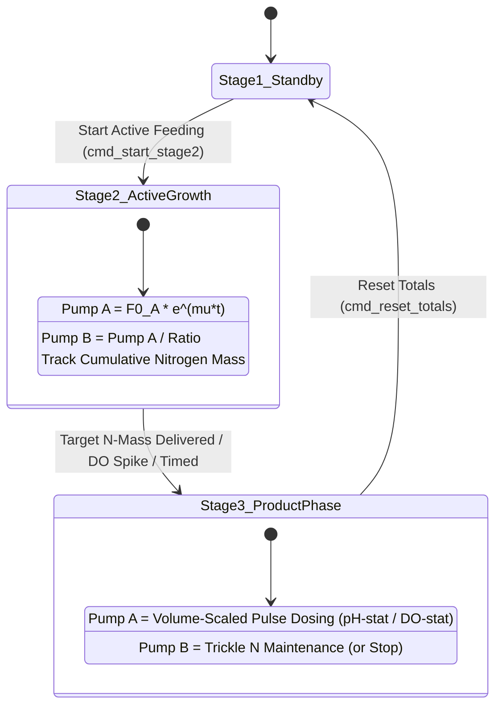
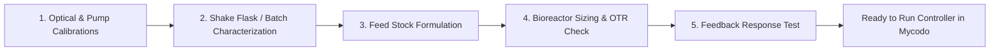

# Stoichiometric Fed-Batch & Dynamic C:N Controller

Generalized Mycodo custom function for advanced dual-pump fed-batch bioprocesses (e.g., Carbon + Nitrogen feeding, Substrate + Co-feed, Acid + Base). Couples first-principles stoichiometric mass balances ($Y_{X/S}, Y_{X/N}$), physiological stage transition triggers (nitrogen mass delivered / DO-spike), adaptive C:N nutrient balancing (maintenance trickle feeding), and volume-scaled feedback dosing.

---

## Key Capabilities

1. **First-Principles Stoichiometric Modeling (`stoichiometric_balance`):**
   - Automatically computes starting feed rates ($F_{0,A}, F_{0,B}$), optimal stoichiometric ratio ($R_{A:B}$), and target nitrogen mass from starting volume ($V_0$), initial biomass ($X_0$), target biomass ($X_{\text{target}}$), yields ($Y_{X/S}, Y_{X/N}$), and stock concentrations ($S_{i,A}, N_{i,B}$).
2. **Dynamic C:N & Growth Profiles:**
   - Supports **Exponential** ($F_0 e^{\mu t}$), **Linear ramp** ($F_0 + k t$), and **Constant** rate feeding.
   - Dual-pump coupling: Coupled Ratio ($F_B = F_A / R_{A:B}$) or Independent Profiles.
3. **Physiological Stage Transitions (Stage 2 $\rightarrow$ Stage 3):**
   - **Stoichiometric N-Mass Delivered:** Automatically switches to product accumulation when the exact mass of nitrogen required to reach target cell dry weight has been delivered ($\int F_B \cdot N_i \, dt \ge M_{N,\text{target}}$), eliminating phase-switch timing errors caused by lag phase variability.
   - **Online Sensor Trigger:** Transitions upon detecting a dissolved oxygen (DO) spike or pH shift signaling nutrient exhaustion.
   - **Timed Elapsed Duration:** Legacy fixed duration fallback.
4. **Adaptive Stage 3 Product / Accumulation Policies:**
   - **Trickle Nitrogen:** Delivers a constant low-level maintenance nitrogen feed ($F_{B,\text{maint}}$) during Stage 3 to prevent cellular metabolic arrest and maximize total carbon conversion.
   - **Full Starvation (`stop`):** Shuts off Pump B for classic nutrient-starvation product induction (e.g., PHA / lipid accumulation).
   - **Volume-Adaptive Feedback Micro-Dosing:** Sensor-stat pulse doses for Pump A (pH-stat on acidic feeds or DO-stat on neutral feeds) scale dynamically with current working broth volume ($V(t)/V_0$).
5. **Real-Time Mass & Volume Tracking:**
   - Live integration of working liquid volume $V(t)$, estimated biomass $X(t)$, and cumulative delivered elemental masses ($M_C, M_N$).

---

## Bioprocess Architecture & State Machine

---

## Mathematical Foundations

### 1. Specific Uptake & Initial Feed Rates ($F_0$)
$$\text{Initial Biomass Mass: } M_{X,0} = X_0 \cdot V_0 \quad (\text{g CDW})$$
$$\text{Specific Carbon Uptake: } q_S(0) = \frac{\mu}{Y_{X/S}} + m_S \quad (\text{g sub / g CDW / h})$$
$$\text{Specific Nitrogen Uptake: } q_N(0) = \frac{\mu}{Y_{X/N}} \quad (\text{g N-salt / g CDW / h})$$
$$\text{Initial Pump A Flow: } F_{0,A} = \frac{q_S(0) \cdot M_{X,0}}{S_{i,A}} \times 1000.0 \quad (\text{mL/h})$$
$$\text{Initial Pump B Flow: } F_{0,B} = \frac{q_N(0) \cdot M_{X,0}}{N_{i,B}} \times 1000.0 \quad (\text{mL/h})$$

### 2. Stoichiometric Volumetric Ratio ($R_{A:B}$)
$$R_{A:B} = \frac{F_{0,A}}{F_{0,B}} = \frac{(\mu / Y_{X/S} + m_S) \cdot N_{i,B}}{(\mu / Y_{X/N}) \cdot S_{i,A}}$$

### 3. Stage Transition Nitrogen Budget ($M_{N,\text{target}}$)
$$M_{N,\text{target}} = \frac{(X_{\text{target}} - X_0) \cdot V_0}{Y_{X/N}} \quad (\text{g N-salt})$$
$$V_{N,\text{target}} = \frac{M_{N,\text{target}}}{N_{i,B}} \times 1000.0 \quad (\text{mL})$$

### 4. Volume-Adaptive Dosing in Stage 3
$$V(t) = V_0 + \frac{\text{Total A (mL)} + \text{Total B (mL)}}{1000.0} \quad (\text{L})$$
$$\text{Effective Pulse Volume} = \text{Base Dose} \times \max\left(1.0, \frac{V(t)}{V_0}\right) \quad (\text{mL})$$

---

## Configuration Reference

| Parameter | Type | Default | Description |
| :--- | :--- | :--- | :--- |
| `period` | Float | `30.0` | Control loop cycle time in seconds |
| `calc_mode` | Select | `direct_rates` | `direct_rates` (manual $F_0$, ratio) or `stoichiometric_balance` (auto $F_0$, ratio, N-target) |
| `growth_rate_mu` | Float | `0.268` | Target specific growth rate $\mu$ ($1/\text{h}$) |
| `feed_profile` | Select | `exponential` | Profile shape: `exponential`, `linear`, or `constant` |
| `control_mode` | Select | `coupled_ratio` | `coupled_ratio` ($F_B = F_A / R_{A:B}$) or `independent` |
| `feed_rate_scale` | Float | `1.0` | Active feed rate multiplier (1.0 = 100%, adjustable live via Trim buttons) |
| `initial_volume_l` | Float | `5.0` | Initial bioreactor working volume $V_0$ ($\text{L}$) |
| `initial_biomass_g_l` | Float | `2.0` | Initial biomass concentration $X_0$ ($\text{g/L CDW}$) |
| `target_biomass_g_l` | Float | `25.0` | Target biomass $X_{\text{target}}$ at end of Stage 2 ($\text{g/L CDW}$) |
| `yield_yxs_g_g` | Float | `0.65` | Biomass yield on carbon substrate $Y_{X/S}$ ($\text{g CDW / g sub}$) |
| `yield_yxn_g_g` | Float | `4.20` | Biomass yield on nitrogen stock salt $Y_{X/N}$ ($\text{g CDW / g N-salt}$) |
| `stock_c_conc_g_l` | Float | `910.0` | Carbon substrate concentration in Pump A bottle $S_{i,A}$ ($\text{g/L}$) |
| `stock_n_conc_g_l` | Float | `500.0` | Nitrogen salt concentration in Pump B bottle $N_{i,B}$ ($\text{g/L}$) |
| `maintenance_ms_g_g_h` | Float | `0.02` | Maintenance coefficient $m_S$ ($\text{g sub / g CDW / h}$) |
| `ratio_a_to_b` | Float | `2.684` | Manual ratio ($F_{0,A} / F_{0,B} = 8.08 / 3.01 = 2.684$) |
| `f0_pump_a_ml_h` | Float | `8.08` | Manual initial rate for Pump A ($\text{mL/h}$) |
| `f0_pump_b_ml_h` | Float | `3.01` | Manual initial rate for Pump B ($\text{mL/h}$) |
| `transition_trigger` | Select | `time_duration` | Transition mode: `time_duration`, `nitrogen_delivered`, or `sensor_trigger` |
| `stage2_duration_hours` | Float | `6.13` | Stage 2 duration / safety timeout ($\text{h}$) |
| `output_pump_a` | Channel | — | Output channel for Carbon Pump |
| `pump_a_cal_ml_min` | Float | `10.0` | Pump A flow calibration at 100% duty cycle ($\text{mL/min}$) |
| `pump_a_min_clamp_ml_h` / `max` | Float | `1.0` / `55.0` | Min/Max safe flow rate bounds for Pump A ($\text{mL/h}$) |
| `output_pump_b` | Channel | — | Output channel for Nitrogen Pump |
| `pump_b_cal_ml_min` | Float | `10.0` | Pump B flow calibration at 100% duty cycle ($\text{mL/min}$) |
| `pump_b_min_clamp_ml_h` / `max` | Float | `0.5` / `25.0` | Min/Max safe flow rate bounds for Pump B ($\text{mL/h}$) |
| `stage3_pump_b_action` | Select | `stop` | Stage 3 policy: `stop` (0 mL/h full N-starvation), `trickle_nitrogen`, `maintain`, or `continue_profile` |
| `stage3_trickle_n_rate_ml_h` | Float | `0.5` | Nitrogen flow rate during Stage 3 trickle mode ($\text{mL/h}$) |
| `select_feedback_sensor` | Measurement | — | Stage 3 feedback measurement (pH or DO) |
| `feedback_trigger_direction` | Select | `above_threshold` | `above_threshold` (pH-stat / DO-spike) or `below_threshold` (DO-stat) |
| `feedback_threshold_val` | Float | `6.52` | Trigger setpoint value ($\text{pH } > 6.52$) |
| `feedback_dose_vol_ml` | Float | `0.10` | Base pulse dose volume ($\text{mL}$) |
| `volume_adaptive_dose` | Bool | `True` | Scale pulse dose volume proportionally with $V(t)/V_0$ |
| `feedback_cooldown_sec` | Float | `90.0` | Minimum pause between consecutive pulses ($\text{s}$) |
| `stage3_max_rate_clamp_ml_h` | Float | `15.0` | Maximum allowable Pump A dosage per rolling 1-hour window ($\text{mL/h}$) |

---

## Strain Characterization & Parameter Estimation (Pre-Work Guide)

### Step 1: Optical & Physical Calibrations
1. **$\text{OD}_{600}$ to Cell Dry Weight (CDW) Standard Curve ($k_{\text{OD}}$):**
   * Grow the strain to varying optical densities ($\text{OD}_{600} = 0.5 \text{ to } 10$).
   * Filter known sample volumes through pre-weighed $0.22\,\mu\text{m}$ membrane filters, wash with DI water, and dry at $80–105^\circ\text{C}$ to constant weight.
   * Determine slope $k_{\text{OD}}$: $\text{CDW (g/L)} = k_{\text{OD}} \times \text{OD}_{600}$.
2. **Peristaltic Pump Liquid Calibration:**
   * Measure actual pumped mass over $60\text{ seconds}$ at $100\%$ duty cycle using the exact feed formulations and tubing. Fill in `pump_a_cal_ml_min` and `pump_b_cal_ml_min`.

### Step 2: Kinetic & Yield Characterization
1. **Maximum Specific Growth Rate ($\mu_{\max}$):**
   * Measure $\text{OD}_{600}$ over time during exponential batch growth. Plot $\ln(\text{OD})$ vs time; slope is $\mu_{\max}$. Set `growth_rate_mu` = $(0.60–0.80) \times \mu_{\max}$.
2. **Biomass Yield on Carbon ($Y_{X/S}$):**
   * In a carbon-limited batch, calculate $Y_{X/S} = \Delta X / \Delta S$ ($\text{g CDW / g substrate consumed}$).
3. **Biomass Yield on Nitrogen ($Y_{X/N}$):**
   * In a nitrogen-limited batch with excess carbon, calculate $Y_{X/N} = \Delta X / M_{N,\text{salt fed}}$ ($\text{g CDW / g nitrogen salt}$).

### Step 3: Feed Stock Formulation
1. Prepare high-concentration stock feeds to minimize culture dilution:
   * **Carbon / Primary Substrate:** Concentrated feed solution (e.g., sugars $500–700\text{ g/L}$, pure liquid substrates, etc.).
   * **Nitrogen / Co-Feed:** Aqueous stock near room-temperature solubility (e.g., nitrogen salts $200–500\text{ g/L}$, amino acid/complex feeds).

### Step 4: Bioreactor Sizing & OTR Feasibility
1. Compute estimated final volume $V_{\text{final}} = V_0 + \Delta V_A + \Delta V_B$ to ensure $V_{\text{final}} < V_{\text{max, vessel}}$.
2. Verify that peak Oxygen Uptake Rate ($OUR_{\max} = \frac{\mu X_{\text{target}} V_{\text{final}}}{Y_{X/O_2}}$) is below the bioreactor's maximum Oxygen Transfer Rate ($OTR_{\max}$).

### Step 5: Stage 3 Feedback Mode Selection
1. Perform a pulse test near batch substrate exhaustion:
   * **Substrates altering pH upon consumption (e.g. organic acids / ammonium salts):** pH shifts upon starvation; dosing restores setpoint $\rightarrow$ Use **pH-stat** (`above_threshold`).
   * **Substrates with rapid respiratory response (e.g. sugars, alcohols):** Respiration halts upon starvation $\rightarrow$ DO spikes $\rightarrow$ Use **DO-stat** or **DO-spike trigger**.

---

## Operational Commands

- **Start Active Feeding (Stage 2):** Calculates initial stoichiometric flow rates, starts growth profiles, and enables mass integration.
- **Switch to Product Stage (Stage 3):** Manually switches controller to Stage 3 policy (nitrogen cutoff + adaptive sensor-stat micro-dosing).
- **Pause / Resume:** Temporarily halts pump pulsing without losing timers or volume integration totals.
- **Reset Totals & Stage:** Reinitializes cumulative volume counters and resets controller state back to Stage 1 (Standby).
- **Trim Feed -10% / +10%:** Live decrement/increment of active feed rate multiplier without restarting controller.
- **Quick Foam Backoff (-25%):** Instant reduction of feeding to 75% for emergency foam mitigation.
- **Reset Trim (100%):** Restores feed multiplier back to nominal rate (1.0).